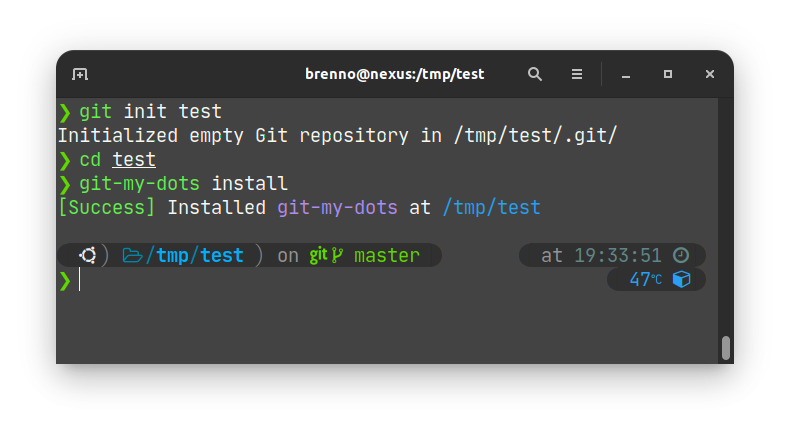
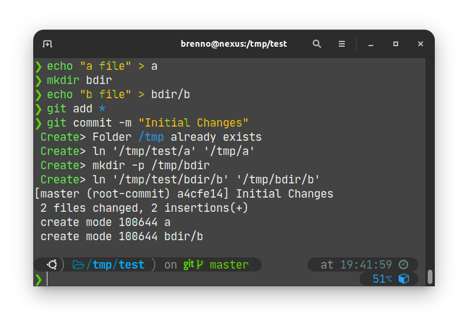
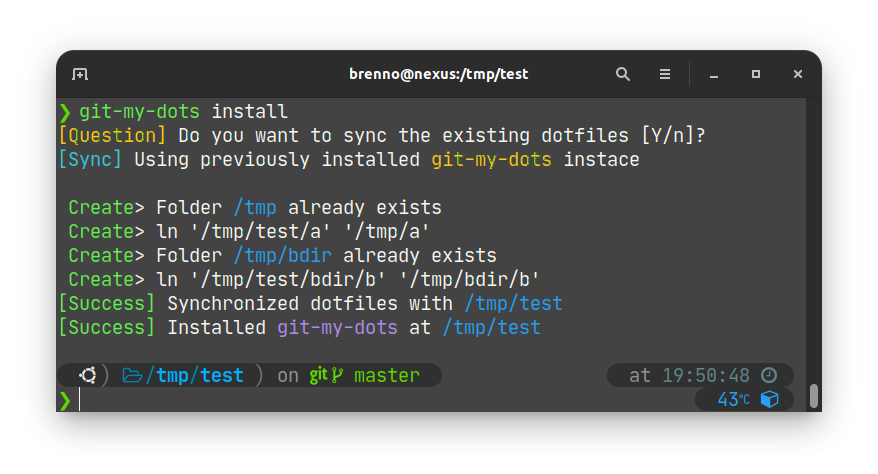
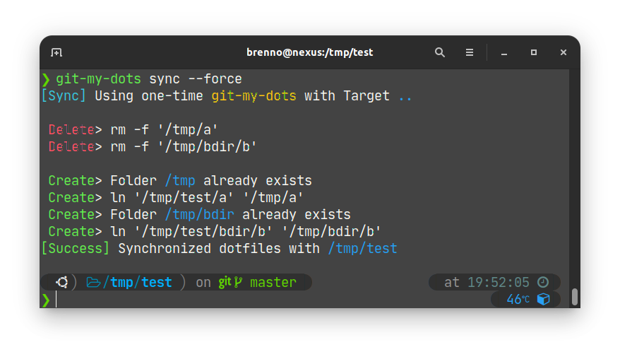
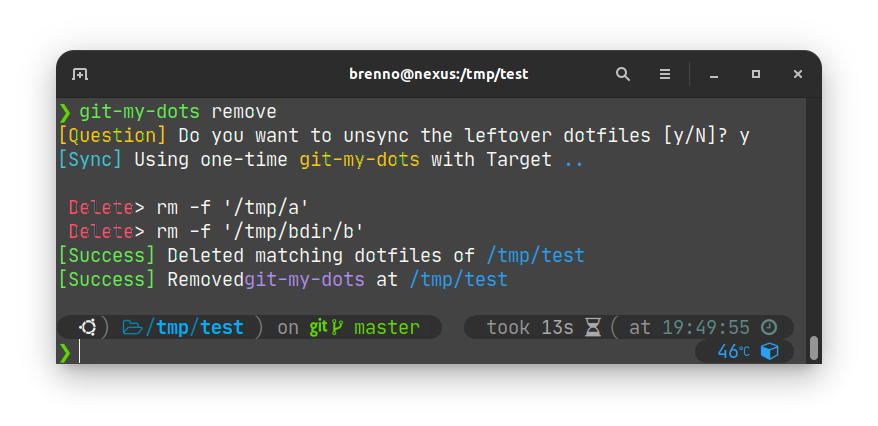
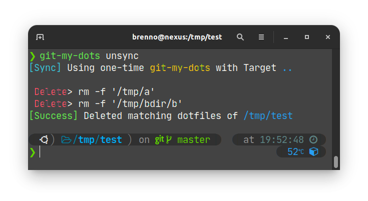
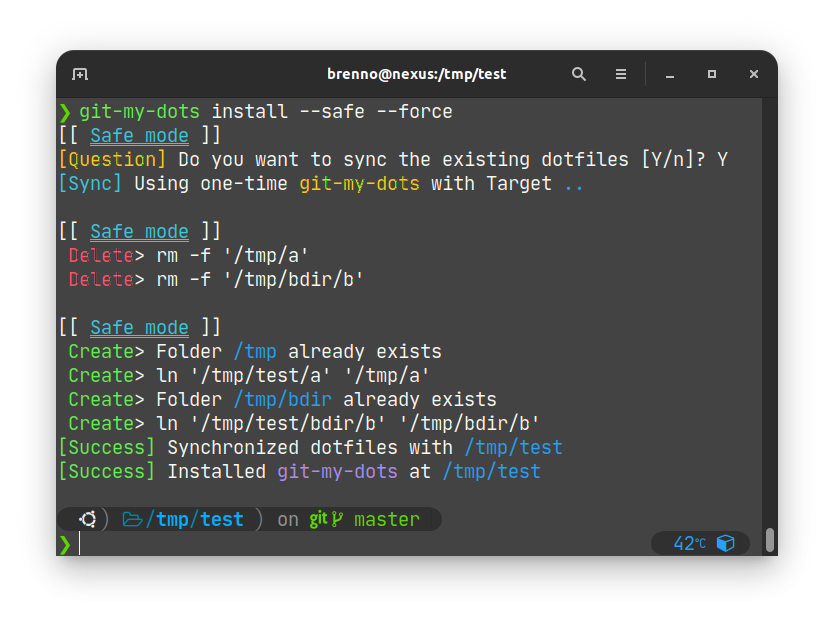

# **Git My Dots!**
**Git My Dots!** is yet another [dotfile](https://dotfiles.github.io/) manager with <u>0 dependencies</u><sup>[*](#zero-dependencies)</sup> developed purely in Shell Script that aims to make your life easier when dealing with dotfiles, **with just 4 simple commands**!

**Git My Dots!** is different from other projects because it *kills two birds with one stone*: since people use dotfile mangers exactly because they want to back them up with Git, **Git My Dots!** takes advantage of that and mirrors new/deleted files on `git commit` <sup>after installation, read more below</sup>. As such, it binds to Git **without taking away your control over it**.

You can *"install"* it to as many repositories as you please, making it easier to split your dots into multiple different repositories. Maybe you have one dotfile repository for TUI tools and one for your graphical setup? That'd be cool.

It can also be used to manually synchronize and even de-synchronize repositories, requiring only two simple commands in order to completely change your dotfiles. Maybe you have one for the day and one for the night, or maybe you saw something cool on [r/Unixp*rn](https://reddit.com/r/unixporn) and wanted to try it out, without having to commit to the new dots or having to move yours around. [See this tip](#trying-out-new-dotfiles) if you want to try out new dots.

Oh yeah, forgot to mention: it's based on file structure.

---

## How does it work?

All of **Git My Dots!** features are completely optional, so you can use it however you may like. Here we'll describe the commands, how to use them and how it's recommended to use them.

- ### Install

    <p align=center>
    
    </p>
    <p align=center><sup>Example using the install command</sup></p>

    The install command will hook **Git My Dots!** to your repository's commits. This means that every file added will have a [hard link](https://www.redhat.com/sysadmin/linking-linux-explained) created on your place of choice, and every file deleted will have the hard link also deleted (on commit!).

    <p align=center>
    
    </p>
    <p align=center><sup>Commiting with Git My Dots! installed</sup></p>

    If the repository is already full of files (when downloading back your repo from GitHub for example) you'll be prompted about syncing everything from the repository.

    <p align=center>
    
    </p>
    <p align=center><sup>Automatically detecting and asking permission to synchronize existing files</sup></p>

---

- ### Sync

    <p align=center>
    
    </p>
    <p align=center><sup>Example of sync using the --force option</sup></p>

    The sync command is a manual command that can be called at any time to synchronize your dotfiles with the repository. An optional <samp>--force</samp> flag may be passed to absolutely ensure you are in sync, deleting the old files and creating them again.

    *Note: Neither sync nor install will ever delete or overwrite existing files without the --force flag*

---

- ### Remove

    <p align=center>
    
    </p>
    <p align=center><sup>Example of remove, unsync leftovers</sup></p>

    Remove is the counterpart command of [install](#install). As such, it will uninstall **Git My Dots!** from the local (or pointed to via [<samp>--source</samp>](#kbd--sourcekbd)) repository. Additionally and contrary to install, it will offer to desync your dots with the repository, meaning it will delete every file that also exists in the repository.

---

- ### Unsync

    <p align=center>
    
    </p>
    <p align=center><sup>Example of unsync</sup></p>

    Just like [remove](#remove) is the counterpart to [install](#install), so is unsync to [sync](#sync). It will remove the synchronized files so that you're clean from them. Just like sync, this command is manual and can be executed at any time, even if **Git My Dots!** [is not installed](#you-dont-need-to-install-it) at the source directory.

---

## Additional Options

**Git My Dots!**'s commands generally accept the following options:

- ### <kbd>--safe</kbd>
    
    Arguably the most useful option, it makes it so commands can't actually create/delete files. As such, any command executed with this option will simply print what it **would** do, were it not for the option.

- ### <kbd>--force</kbd>

    For [install](#install) and [sync](#sync), it guarantess that all files will be synced by deleting old files and creating new ones.

\
Example of both options being used:

<p align=center>

</p>
<p align=center><sup>Simulating an installation with forced sync using the --safe option</sup></p>

- ### <kbd>--source</kbd>

    By default, every **Git My Dots!** command executed will default its source to the local directory (`.`). What it means is that install, remove, sync and unsync will all perform operations assuming the local directory is your dotfiles repository.

    Optionally, you can use this, well, *option*, to point **Git My Dots!** to another directory. For example:


- ### <kbd>--target</kbd>

    Similarly to [<samp>--source</samp>](#kbd--sourcekbd), **Git My Dots!** will default the *target* directory to the parent of the current directory (`..`). The *target* directory is the directory to where we want to mirror our *source* directory.


Example of both being used:
```sh
me@machine:/usr/lib$ git-my-dots --source=$HOME/dotfiles --target=$HOME
```

---

## Tips

- ### You don't need to install it!

    First, a heads up: if you've been following along until here, you've noticed I tend to use the word **install** a lot. Bear in mind that nowhere on this document does *install* refer to *installing this tool* (as in installing it via `apt`, `pip`, `pacman`, etc.) **but** to installing the `pre-commit` script to your Git repository.

    With that out of the way, it's important to note that this tool **doesn't require you to ever run** `git-my-dots install`! If you're not comfortable with the idea of installing it, you can always manually run [sync](#sync) whenever you feel like syncing.

- ### Files mirrored by this tool are **Hard Links**

    When mirroring files, rather than duplicating the files, **Git My Dots!** will create hard links to them. That means that editing either the original or the mirrored file **will alter both**.

    This is a plus, because some tools will have interfaces to abstract their dotfiles, and you'd probably want that to be synced. So rather than having to copy the files over to the repository, they are already, by default!

    And if a tool would ever dare to hurt that precious dotfile (like resetting it to factory default), you could always just `git checkout -- my-file-that-i-love-so-much-but-got-reset`. This is Git we're talking about, after all!

    This also mean that you can see what got fiddled with in your file with `git diff`!

- ### Trying out new dotfiles

    If you want to try out new dots without having to worry about ruining yours, do I have a tip for you! Let's assume you've already gotten a personal dotfiles repository <sup>(which doesn't necessarily have **Git My Dots!** installed on, [refer to this tip](#you-dont-need-to-install-it))</sup> and you've cloned the new dots' repository somewhere.

    In this case what I'd do is:
    ```sh
    # First, remove our dots from their locations
    $ cd my-dots-repository
    $ git-my-dots unsync

    # Then, sync the new dots (note: it doesn't install git-my-dots on that repository!)
    $ cd new-dots-repository
    $ git-my-dots sync --force

    # Didn't like it? No worries, it's easy to revert!
    $ git-my-dots unsync
    $ cd my-dots-repository
    $ git-my-dots sync --force
    ```
    *Note that the [<samp>--force</samp>](#kbd--forcekbd) option will make sure colliding files are overwritten. If you're afraid it's gonna overwrite something it shouldn't, consider trying it out with the [<samp>--safe</samp>](#kbd--safekbd) option, which will print out everything that would get modified, without actually doing so. Refer to their respective sections for more info.*

---

## FAQ

- ### Zero dependencies ?
    I mean, you've got [Bash](https://www.gnu.org/software/bash/) installed... Right?

- ### I see it works with `git commit`, but what about `git <command>` ?
    At the moment, **Git My Dots!** will only **automatically** synchronize after `git commit` commads. That being said, [sync](#sync) was made so it can always be executed, so you could use that whenever.

    I'm thinking about an auto-update on `git pull`, but maybe you'd want to review the changes before the synchronization kicks in...


- ### Why **Git My Dots!** ?
    Well, [dotfiler](https://github.com/svetlyak40wt/dotfiler) was already taken, and way too many people call their dotfiles [oh-my-dots](https://github.com/search?q=oh-my-dots), so I had to come up with a bit of originality.
    
    Since this tool mainly resolves around Git, I realized that putting it on the name would would make it easier to search for. In the end, it also became a play of words, with *Git* being like *Get*, as in *"Get my dots!!"*.